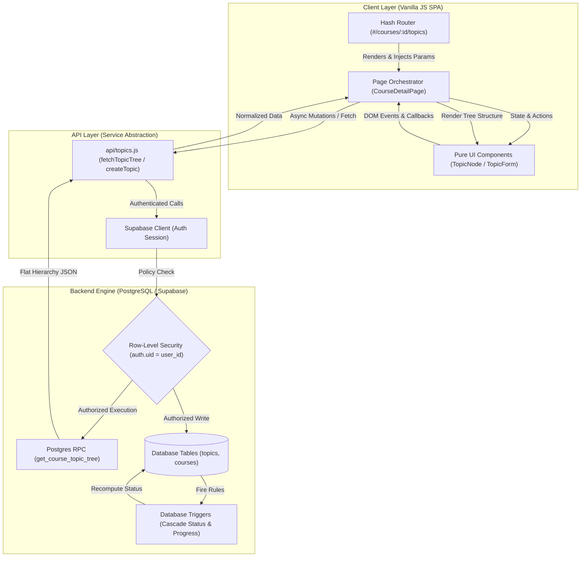

# Academic Management System 🎓

[](https://developer.mozilla.org/en-US/docs/Web/JavaScript)
[](https://vitejs.dev/)
[](https://supabase.com/)
[](https://www.postgresql.org/)
[](LICENSE)

A modular, production-ready Single Page Application (SPA) designed to manage university semesters, courses, and hierarchical topic trees with database-enforced integrity. Built with pure Vanilla JavaScript, clean architecture patterns, and Supabase.

---

## 🚀 Key Features & Architectural Highlights

- **Clean Architecture & Separation of Concerns:** Strict isolation between API calls, UI presentation components, and page orchestrators.
- **Hierarchical Topic Tree (Recursive CTE):** Topic trees fetched in a single network roundtrip via a custom PostgreSQL RPC (`get_course_topic_tree`), preventing $N+1$ query overhead.
- **Database-Driven Integrity & Triggers:** Automated leaf-to-parent status propagation and course progress computations executed entirely within Postgres.
- **Custom Hash Router:** Zero-dependency client-side SPA routing supporting dynamic parameters (`#/courses/:id/topics`), navigation teardown, and route guards.
- **Concurrency & Memory Safeguards:** Token-based invalidation to discard stale asynchronous responses (Race Conditions) and clean subscription teardowns.
- **Row-Level Security (RLS):** Fully scoped PostgreSQL authorization policies ensuring strict tenant data isolation.

---

## 🏛️ System Architecture & Data Flow



### Flow Breakdown

1. **Presentation Isolation:** `TopicNode` and `TopicForm` do not interact with the database directly; they emit callbacks to the `CourseDetailPage` orchestrator.
2. **Deterministic Mutation:** The API calculates `order` based on sibling count (`MAX(order) + 1`), leaves `status` to database defaults (`not_started`), and relies on DB-level cascade rules.
3. **Single Roundtrip Tree Fetch:** The page uses a single PostgreSQL recursive RPC (`get_course_topic_tree`) to pull normalized topic trees with zero $N+1$ query overhead.
4. **Trigger-Driven State:** Leaf mutations cause database triggers to recompute parent statuses and course progress without manual client-side computation.

---

## 🛠️ Tech Stack

* **Frontend:** Vanilla JavaScript (ES Modules), HTML5, Modern CSS3
* **Tooling & Bundler:** Vite
* **Backend & Database:** Supabase, PostgreSQL (Triggers, Recursive CTEs, Custom RPCs, Row-Level Security)
* **Workflow & Standards:** Git & GitHub Flow, Conventional Commits

---

## 📂 Project Architecture

```text
academic-management-system/
├── src/
│   ├── api/          # Supabase client queries, mutations & RPC endpoints
│   ├── components/   # Pure presentation UI components (TopicNode, TopicForm, CourseForm)
│   ├── pages/        # Page orchestrators managing layouts and lifecycle
│   ├── state/        # Event-driven store and hash-based SPA router
│   ├── style.css     # Global layout rules and styling
│   └── main.js       # App entry point, session listeners, and route guards
├── public/           # Static web assets
└── index.html
```

---

## ⚡ Getting Started

### Prerequisites

* Node.js (v18+ recommended)
* A Supabase project with applied SQL schemas, constraints, and RPC functions

### Installation

1. **Clone the repository:**
```bash
git clone https://github.com/ShadiEskafi/academic-management-system.git
cd academic-management-system
```

2. **Install dependencies:**
```bash
npm install
```

3. **Configure environment variables:**
Create a `.env` file in the root directory:
```env
VITE_SUPABASE_URL=your_supabase_project_url
VITE_SUPABASE_ANON_KEY=your_supabase_anon_key
```

4. **Run the local development server:**
```bash
npm run dev
```

---

## 🛡️ License

This project is licensed under the **Business Source License 1.1 (BSL 1.1)**.

* **Free for:** Non-commercial, educational, research, and local evaluation use.
* **Restricted:** You may **not** provide this software as a hosted, managed, or commercial service (SaaS), nor bundle it into a commercial offering without prior written authorization.
* See the full [LICENSE](LICENSE) file for exact legal terms.

```
academic-management-system
├─ index.html
├─ LICENSE
├─ package-lock.json
├─ package.json
├─ public
│  ├─ favicon.svg
│  └─ icons.svg
├─ README.md
└─ src
   ├─ api
   │  ├─ assessments.js
   │  ├─ assignments.js
   │  ├─ auth.js
   │  ├─ availability.js
   │  ├─ courses.js
   │  ├─ exams.js
   │  ├─ semesters.js
   │  ├─ studySessions.js
   │  ├─ supabaseClient.js
   │  └─ topics.js
   ├─ assets
   │  ├─ hero.png
   │  ├─ javascript.svg
   │  └─ vite.svg
   ├─ components
   │  ├─ ActiveSessionModal.js
   │  ├─ AppShell.js
   │  ├─ AssessmentsTable.js
   │  ├─ AssignmentForm.js
   │  ├─ AuthForm.js
   │  ├─ AvailabilityModal.js
   │  ├─ CourseForm.js
   │  ├─ CourseModals.js
   │  ├─ ExamForm.js
   │  ├─ LogAchievementModal.js
   │  ├─ SemesterForm.js
   │  ├─ SemesterModals.js
   │  ├─ StudySessionLog.js
   │  ├─ TopicForm.js
   │  ├─ TopicModals.js
   │  └─ TopicNode.js
   ├─ main.js
   ├─ pages
   │  ├─ AuthPage.js
   │  ├─ AvailabilityPage.js
   │  ├─ CourseDetailPage.js
   │  ├─ CoursesPage.js
   │  └─ SemestersPage.js
   ├─ state
   │  ├─ router.js
   │  └─ store.js
   ├─ style.css
   └─ utils
      ├─ icons.js
      ├─ sessionManager.js
      ├─ skeletons.js
      └─ toast.js

```